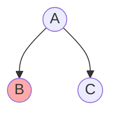
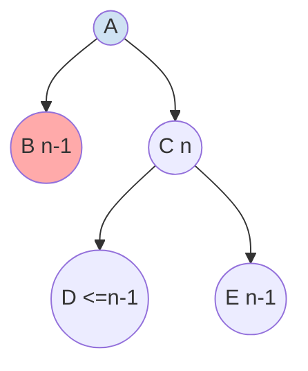
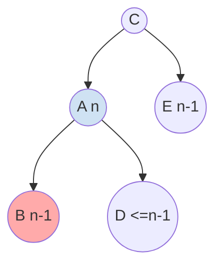
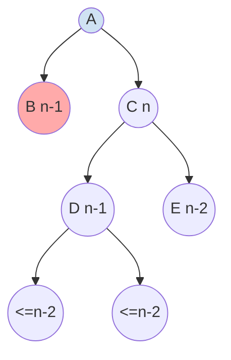
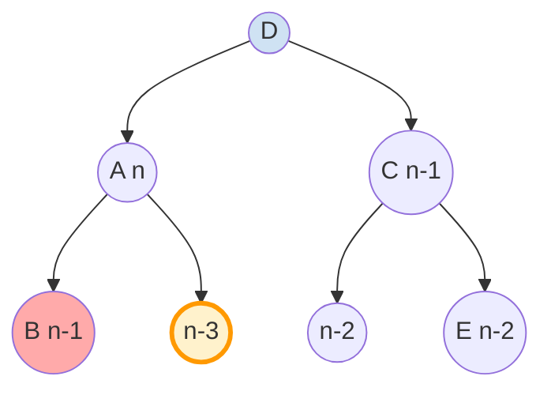
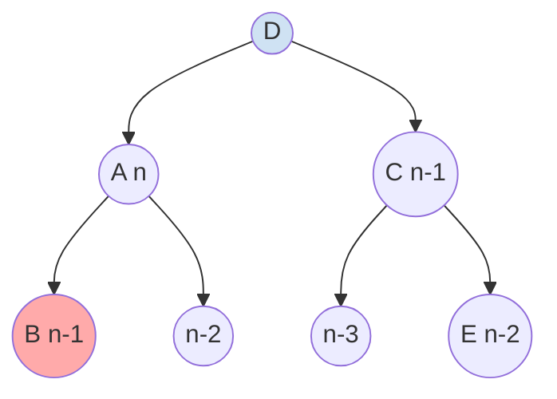
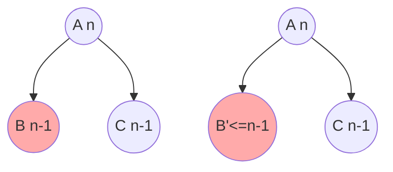
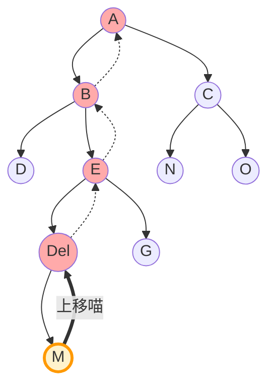

*Avl树remove操作可以通过自顶向下的旋转方式维持删除过程的平衡，过程与代码如下*

---
### Part1.思路与可行性

Avl树进行删除时产生的可能影响是该子树路径上高度的减小1而导致的 |h<sub>left</sup> - h<sub>right</sub>|>=2,
因此我们可以通过在删除过程中，**维持被删除子树的高度始终不小于其兄弟树来维护平衡**

平衡的证明：对任意位置的删除操作，如图，若删除节点在B节点的子树上，删除后h<sub>B</sub>至多 -1。若删除前h<sub>B</sub> >= h<sub>A</sub>,即删除后h<sub>A</sub> - h<sub>B</sub> <= 1。
所以，在删除路径上的任意一层，若有被删除子树的高度 >= 其兄弟子树的高度，删除后AVL树的平衡不被破坏。


由于删除本身就是自根向下的过程，因此不断调整子树的的高度成为可能。

---

但与此同时，可以注意到，删除后路径上的所有子树的高度变化是不可预测的（-1 或 不变），
因此，必须维护一个回溯表以记录路径上所有节点，自下而上的维护高度是不可避免的。

而对于其他非删除路径上的节点，删除操作后高度则不会改变，故时间复杂度为`o(logn)` 

---
### Part2.全流程

在原有AVL树的定义上的新删除过程，~~顺便优化了教材的递归带来的开销 ~~,为了避免递归调用（加上省去了回溯过程）使用了双重指针来维护节点间的关系ww
```cpp
template<class KEY , class OTHER>
void AvlTree2<KEY , OTHER>::remove(const KEY &key) {
    AVLNode **cur = &root; 
    AVLNode *tmp; //这是临时节点
    KEY now  = key; //教材删除方法
    ...
```
---
#### I. 当前节点不为目标且双子存在时（超级重要）

以删除在左子树上为例：

- 若左子树高度 不小于 右子树高度 -> *符合平衡条件，继续向下

- 若h<sub>left</sup> < h<sub>right</sub> , 则h<sub>left</sup> - h<sub>right</sub> = -1 ->  *主要考虑情况* ，
	我们通过旋转操作来维持高度差
---
##### 情况i：兄弟树的外侧子树高度大于等于内侧子树


我们可以采用RR（LL）操作，得到变换后的图像



变换后可以发现 A树 大于等于 E树的高度，符合了平衡条件，因此可以下移节点至A
>	实际上B树的高度也大于等于D树，因此可以直接下移节点到B节点，~~但实现起来太烦了。没有一致性

---
##### 情况ii：兄弟树的外侧子树高度小于内侧子树


然而我们注意到，若简单的使用双旋转RL（LR），可能造成A节点失衡


因此，我们应该选择D子树更高的子树（h=n-2）作为B的新兄弟。此时实现了被删除路径上子树高度大于等于兄弟节点高度的操作


由此，我们在原有的LR与RL操作上封装了特殊双旋转操作
```cpp
// In remove function
template<class KEY , class OTHER>
void AvlTree2<KEY , OTHER>::RL_spec(AVLNode *&node) {
    AVLNode *target = node-> r_child-> l_child;
    if (height(target-> l_child) < height(target-> r_child)) {
        AVLNode *tmp = target-> l_child;
        target-> l_child = target-> r_child;
        target-> r_child = tmp;
    }
    RL(node);
}
template<class KEY , class OTHER>
void AvlTree2<KEY , OTHER>::LR_spec(AVLNode *&node) {
    AVLNode *target = node-> l_child-> r_child;
    if (height(target-> r_child) < height(target-> l_child)) {
        AVLNode *tmp = target-> r_child;
        target-> r_child = target->  l_child;
        target-> l_child = tmp;
    }
    LL(node);
}
```

---
#### II. 当前节点恰为目标值

与课上相同的操作：若有双孩则转移，若无双孩则退出
```cpp
 while (*cur) {
        if (now == (*cur)-> data.key)
        {
            if (!(*cur)-> l_child || !(*cur)-> r_child) {
                break;
            }
            tmp = (*cur)-> r_child;
            while (tmp-> l_child)
                tmp = tmp-> l_child;
            (*cur)-> data = tmp-> data;
            now = tmp-> data.key;
        }
        ...
```

---
#### III.避免递归调用的方法

为了取消递归开销，这里采用：双重指针直接维护与父节点的关系；~~链表~~（这里直接用了stack库，*因为链表写红温了*）来维护删除路径：
```cpp
template<class KEY , class OTHER>
void AvlTree2<KEY , OTHER>::remove(const KEY &key) {
    AVLNode **cur = &root;
    AVLNode *tmp;
    KEY now  = key;
    stack<AVLNode *> path; // Maintain the path to adjust the height
    ...

```

---
#### IV.退出循环后
同教材的递归结束操作
```cpp
// In remove function
 if (!*cur) {
        std::cout<<key<<" 404 NOT FOUND!\n";
        return;
    }
    tmp =  *cur;
    *cur = (*cur)-> l_child ? (*cur)-> l_child : (*cur)-> r_child;
    if (*cur)
        path.push(*cur); // the last node
    delete tmp;
	...
```

---
#### V.回溯路径维护

虽然挺直观的，但写在代码里就全是灾难()
     path保存高度可能变化的回溯路径。
     but本实现并不总是向根回溯更新高度。
     如果当前节点左右子树高度相等
          `` hL == hR`
     删除其中一侧后
	     `max(hL - 1 , hR)`
     节点高度不会变化。所以高度变化不会继续向上传播。
     此时path可以直接清空。

 #如图，A的高度不变，辣么A以上的高度也不变
---
#### VI.删除后维护高度

根据维护的path路径自底向上地调整高度

```cpp
template<class KEY , class OTHER>
void AvlTree2<KEY , OTHER>::shuffle_height_mod(stack<AVLNode *>path){ //contained operations of deletion
    AVLNode *tmp;
    while (!path.empty())
    {
        tmp = path.top();
        path.pop();
        tmp-> height = 1 + (height(tmp-> l_child) > height(tmp-> r_child) ? height(tmp-> l_child) : height(tmp-> r_child));
    }
}
```


~~方法二：采用后序遍历~~ **已弃用** 

```cpp
template<class KEY , class OTHER>
void AvlTree2<KEY , OTHER>::shuffle_height() {
    if (!root) // check empty
        return;
    std::stack<std::pair<AVLNode* , int>> nodes; //Post traverse to proofread all heights :)
    nodes.emplace(root , 0);

    while (!nodes.empty()) {
        if (auto *tmp = &nodes.top() ; 1 == tmp-> second) {
            tmp-> first-> height = 1 + (height(tmp-> first-> l_child) > height(tmp-> first-> r_child) ? height(tmp-> first-> l_child) : height(tmp-> first-> r_child));
            nodes.pop();
        }
        else {
            ++tmp-> second;
            if (tmp-> first-> r_child)
                nodes.emplace(tmp-> first-> r_child , 0);
            if (tmp-> first-> l_child)
                nodes.emplace(tmp-> first-> l_child , 0);
        }
    }
}// (时间复杂度为o（n）) 
```

---
### Part3.一点点分析

This is a 自顶向下的AVL树删除操作
可行性：
	- 时间与空间复杂度一致，都为o（logn） >>> 很可惜没有找到一种不用维护路径的方法，否则可以完全舍去回溯过程。#主要是因为AVL删除会波及整棵树的高度
	- \*可以减少考虑很多额外的旋转情况（10 -> 4 ?)
	- (顺便解决了下递归问题)
缺点：
	- 由于是自顶向下的充分条件维护，操作多于回溯法，存在冗余操作。不考虑递归开销，推测性能没有bottom-to-top好（~~但没测过~~）
	- 依旧绕死自己，到现在也不知道思路到底对不对，~~反正坑是踩完了（）
	

---
### Part4.\*主要代码的解读

```cpp
template<class KEY , class OTHER>
void AvlTree2<KEY , OTHER>::remove(const KEY &key) {

    // 使用二级指针cur追踪当前节点,指向当前节点指针.这样可以直接.修改父节点对子树的引用。这避免了维护 parent 指针和无休止的递归返回
    AVLNode **cur = &root;
	 AVLNode *tmp;//临时节点指针
    KEY now  = key;//当前要删除的 key。
    
     /* path保存高度可能变化的回溯路径。
     * but本实现并不总是向根回溯更新高度。
     * 如果当前节点左右子树高度相等
           hL == hR
     * 删除其中一侧后
           max(hL - 1 , hR)
     * 节点高度不会变化。
     * 高度变化不会继续向上传播。
     * 此时path可以直接清空。
       */
    stack<AVLNode *> path;

    /* 搜索删除目标。
     * 在下降过程预先进行旋转
     * 保证删除路径不会进入“严格更矮”的子树。
     */
    while (*cur) {
        if (now == (*cur)-> data.key)//当前key命中now
        {
             //退出循环，进入删除。
            if (!(*cur)-> l_child || !(*cur)-> r_child) {
                break;
            }
            
            // 双子节点情况
            tmp = (*cur)-> r_child;
            while (tmp-> l_child)
                tmp = tmp-> l_child;
                
            (*cur)-> data = tmp-> data;
            now = tmp-> data.key;
        }//这里需要注意，我没有进一步下降cur节点位置，而是采取继续执行后面代码的方式，能够保证循环代码的一致性

         //删除目标位于左子树
        if (now < (*cur)-> data.key) {
        // 若左右子树高度相等，删除左侧后，node.height 不会变化。因此高度传播链在此断裂，保存的回溯路径全部失效。
            if (height((*cur)-> l_child) == height((*cur)-> r_child))

                while (!path.empty())
                    path.pop();

            //  左子树更矮，删除左侧后当前节点可能失衡。因此preemptive rotation。这是Top-down AVL deletion之核心喵awa
            else if (height((*cur)-> l_child) < height((*cur)-> r_child)
                     && (*cur)-> l_child) {

                tmp = (*cur)-> r_child;

                //右孩子右侧更高
                if (height(tmp-> r_child) >= height(tmp-> l_child))
                    RR(*cur);
                //右孩子左侧更\高
                else
                    RL_spec(*cur);
            }
            //当前节点高度可能受后续删除影响，加入回溯路径。
            path.push(*cur);
            //向左下降。
            cur = &(*cur)-> l_child;
        }

        else {//与左侧逻辑对称，两者一定会执行一个，哪怕key==now
            if (height((*cur)-> r_child) == height((*cur)-> l_child))
                while (!path.empty())
                    path.pop();
            else if (height((*cur)-> r_child) < height((*cur)-> l_child)
                     && (*cur)-> r_child) {

                tmp = (*cur)-> l_child;

                if (height(tmp-> l_child) >= height(tmp-> r_child))
                    LL(*cur);
                else
                    LR_spec(*cur);
            }

            path.push(*cur);

            cur = &(*cur)-> r_child;
        }
    }
    if (!*cur) {//search failed
        std::cout<<key<<" 404 NOT FOUND!\n";
        return;
	}
    tmp =  *cur;
    *cur = (*cur)-> l_child ?
           (*cur)-> l_child :
           (*cur)-> r_child;
    if (*cur)//如果最后节点非空
        path.push(*cur);//入栈
    delete tmp;
	//修正高度，只修改path
    shuffle_height_mod(path);

    std::cout<<key<<" removed successfully!\n";
}


template<class KEY , class OTHER>
void AvlTree2<KEY , OTHER>::shuffle_height_mod(stack<AVLNode *>path){ 
//  path记录了保存所有高度可能发生变化的节点.栈顺序从底向上更新高度  
    AVLNode *tmp;
    while (!path.empty())
    {
        tmp = path.top();
        path.pop();
        tmp-> height = 1 + (height(tmp-> l_child) > height(tmp-> r_child) ? height(tmp-> l_child) : height(tmp-> r_child));
    }
}

template<class KEY , class OTHER>
void AvlTree2<KEY , OTHER>::RL_spec(AVLNode *&node) {
    AVLNode *target = node-> r_child-> l_child;
    if (height(target-> l_child) < height(target-> r_child)) {//这里提前调整中间节点结构
        AVLNode *tmp = target-> l_child;
        target-> l_child = target-> r_child;
        target-> r_child = tmp;
    }//去保证删除路径不会进入更矮侧
    RL(node);
}

//逻辑同上
template<class KEY , class OTHER>
void AvlTree2<KEY , OTHER>::LR_spec(AVLNode *&node) {
    AVLNode *target = node-> l_child-> r_child;
    if (height(target-> r_child) < height(target-> l_child)) {
        AVLNode *tmp = target-> r_child;
        target-> r_child = target->  l_child;
        target-> l_child = tmp;
    }
    LL(node);
}
```

### \*Enclosed Are Complete Codes
```cpp
// AVL_modified.h
// Created by LilywhiteHaru on 2026/5/1.
#ifndef AVLTREE_AVL2_H
#define AVLTREE_AVL2_H
#include <stack>
#include "AVL.h"
#include <iostream>
#include <stack>

template <class KEY , class OTHER>
class AvlTree2 {
private:
    struct AVLNode {
        AVLNode  *l_child;
        AVLNode *r_child;
        set<KEY , OTHER> data;
        int height;

        explicit AVLNode(const set<KEY , OTHER> &elem , AVLNode *left = nullptr , AVLNode *right = nullptr , int h = 1):data(elem) , l_child(left) , r_child(right) , height(h) {}
    };

    struct BackTrace
    {

    };
    AVLNode *root;

    void Clear(AVLNode *node);
    void insert(const set<KEY , OTHER> &data , AVLNode *&node);
    void LL(AVLNode *&node);
    void LR(AVLNode *&node);
    void RR(AVLNode *&node);
    void RL(AVLNode *&node);
    void RL_spec(AVLNode *&node);
    void LR_spec(AVLNode *&node);
    void shuffle_height(); // abandoned
    void shuffle_height_mod(stack<AVLNode *> path); // contained the operation of deletion

    static int height(const AVLNode *node){ return (node) ? node-> height : 0 ;}

public:
    AvlTree2():root(nullptr){}
    ~AvlTree2() { Clear() ; }

    void Clear(){Clear(root) ; root = nullptr ;}
    void insert(const set<KEY , OTHER> &data){insert(data , root) ; std::cout<<"set("<<data.key<<" , "<<data.other<<") inserted successfully!\n";}
    void remove(const KEY &key);

};

template<class KEY , class OTHER>
void AvlTree2<KEY , OTHER>::Clear(AVLNode *node) {
    if (!node)// the special condition
        return;
   std::stack<AVLNode *> nodes;
    nodes.push(node);
    while (!nodes.empty()) {
        AVLNode *tmp = nodes.top();
        nodes.pop();
        if (tmp-> r_child)
            nodes.push(tmp-> r_child);
        if (tmp-> l_child)
            nodes.push(tmp-> l_child);
        delete tmp;
    }
}

template<class KEY , class OTHER>
void AvlTree2<KEY , OTHER>::RR(AVLNode *&node) {
    AVLNode *tmp = node-> r_child;
    node-> r_child = tmp-> l_child;
    tmp-> l_child = node;

    node-> height = 1 + (height(node-> l_child) > height(node-> r_child) ? height(node-> l_child) : height(node-> r_child));
    tmp-> height = 1 + (height(tmp-> l_child) > height(tmp-> r_child) ? height(tmp-> l_child) : height(tmp -> r_child));
    node = tmp;
}

template<class KEY , class OTHER>
void AvlTree2<KEY , OTHER>::LL(AVLNode *&node) {
    AVLNode *tmp = node-> l_child;
    node-> l_child = tmp-> r_child;
    tmp-> r_child = node;

    node-> height = 1 + (height(node-> l_child) > height(node-> r_child) ? height(node-> l_child) : height(node-> r_child));
    tmp->height = 1 + (height(tmp-> l_child) > height(tmp-> r_child) ? height(tmp-> l_child) : height(tmp-> r_child));
    node = tmp;
}

template<class KEY , class OTHER>
void AvlTree2<KEY , OTHER>::RL(AVLNode *&node) {
    LL(node-> r_child);
    RR(node);
}
template<class KEY , class OTHER>
void AvlTree2<KEY , OTHER>::LR(AVLNode *&node) {
    RR(node-> l_child);
    LL(node);
}
template<class KEY , class OTHER>
void AvlTree2<KEY , OTHER>::RL_spec(AVLNode *&node) {
    AVLNode *target = node-> r_child-> l_child;
    if (height(target-> l_child) < height(target-> r_child)) {
        AVLNode *tmp = target-> l_child;
        target-> l_child = target-> r_child;
        target-> r_child = tmp;
    }
    RL(node);
}

template<class KEY , class OTHER>
void AvlTree2<KEY , OTHER>::LR_spec(AVLNode *&node) {
    AVLNode *target = node-> l_child-> r_child;
    if (height(target-> r_child) < height(target-> l_child)) {
        AVLNode *tmp = target-> r_child;
        target-> r_child = target->  l_child;
        target-> l_child = tmp;
    }
    LL(node);
}

template<class KEY , class OTHER>
void AvlTree2<KEY , OTHER>::shuffle_height() {
    if (!root) // check empty
        return;
    std::stack<std::pair<AVLNode* , int>> nodes; //Post traverse to proofread all heights :)
    nodes.emplace(root , 0);

    while (!nodes.empty()) {
        if (auto *tmp = &nodes.top() ; 1 == tmp-> second) {
            tmp-> first-> height = 1 + (height(tmp-> first-> l_child) > height(tmp-> first-> r_child) ? height(tmp-> first-> l_child) : height(tmp-> first-> r_child));
            nodes.pop();
        }
        else {
            ++tmp-> second;
            if (tmp-> first-> r_child)
                nodes.emplace(tmp-> first-> r_child , 0);
            if (tmp-> first-> l_child)
                nodes.emplace(tmp-> first-> l_child , 0);
        }
    }
}


template<class KEY , class OTHER>
void AvlTree2<KEY , OTHER>::insert(const set<KEY , OTHER> &data , AVLNode *& node) {
    if (!node)
        node = new AVLNode (data);
    else if (data.key > node-> data.key){
        insert(data , node-> r_child);
        if (2 == height(node-> r_child) - height(node-> l_child)) {
            if (data.key > node-> r_child-> data.key)
                RR(node);
            else
                RL(node);
        }
    }
    else if (data.key < node-> data.key) {
        insert(data , node-> l_child);
        if (2 == height(node-> l_child) - height(node-> r_child)) {
            if (data.key < node-> l_child->data.key)
                LL(node);
            else
                LR(node);
        }
    }
    node-> height = (height(node-> l_child) > height(node-> r_child) ? height(node-> l_child) : height(node-> r_child)) + 1;
}


template<class KEY , class OTHER>
void AvlTree2<KEY , OTHER>::remove(const KEY &key) {
    AVLNode **cur = &root;
    AVLNode *tmp;
    KEY now  = key;
    stack<AVLNode *> path;

    while (*cur) {
        if (now == (*cur)-> data.key)
        {
            if (!(*cur)-> l_child || !(*cur)-> r_child) {
                break;
            }
            tmp = (*cur)-> r_child;
            while (tmp-> l_child)
                tmp = tmp-> l_child;
            (*cur)-> data = tmp-> data;
            now = tmp-> data.key;
        }

        if (now < (*cur)-> data.key) {
            if (height((*cur)-> l_child) == height((*cur)-> r_child)) // if heights equal, the backtrace link breaks.
                while (!path.empty())
                    path.pop();
            else if (height((*cur)-> l_child) < height((*cur)-> r_child) && (*cur)-> l_child) {
                tmp = (*cur)-> r_child;
                if (height(tmp-> r_child) >= height(tmp-> l_child))
                    RR(*cur);
                else
                    RL_spec(*cur);
            }
            path.push(*cur);// append links of back-propagation
            cur = &(*cur)-> l_child;
        }
        else {
            if (height((*cur)-> r_child) == height((*cur)-> l_child))
                while (!path.empty())
                    path.pop();
            else if (height((*cur)-> r_child) < height((*cur)-> l_child) && (*cur)-> r_child) {
                tmp = (*cur)-> l_child;
                if (height(tmp-> l_child) >= height(tmp-> r_child))
                    LL(*cur);
                else
                    LR_spec(*cur);
            }
            path.push(*cur);// append links of back-propagation
            cur = &(*cur)-> r_child;
        }
    }
    if (!*cur) {
        std::cout<<key<<" 404 NOT FOUND!\n";
        return;
    }
    tmp =  *cur;
    *cur = (*cur)-> l_child ? (*cur)-> l_child : (*cur)-> r_child;
    if (*cur)
        path.push(*cur); // the last node
    delete tmp;

    shuffle_height_mod(path); // adjust the change of the height due to delete operation
    std::cout<<key<<" removed successfully!\n";
}

template<class KEY , class OTHER>
void AvlTree2<KEY , OTHER>::shuffle_height_mod(stack<AVLNode *>path){ //contained operations of deletion
    AVLNode *tmp;
    while (!path.empty())
    {
        tmp = path.top();
        path.pop();
        tmp-> height = 1 + (height(tmp-> l_child) > height(tmp-> r_child) ? height(tmp-> l_child) : height(tmp-> r_child));
    }
}
#endif //AVLTREE_AVL2_H
```

---
测试代码

```cpp
//test.cpp
//test code
#include "AVL.h"
#include "AVL_modified.h"
int main() {
    set<int , char> sets[30]; // self_defined type 'set'


    AvlTree2<int , char> t2;
    for (int i = 0 ; i < 26 ; ++i) {
        sets[i] = {i , static_cast<char>('z' - i)};
        t2.insert(sets[i]);
    }
    for (int i = 0 ; i < 30 ; ++i)
        t2.remove(i);

    // AvlTree<int , char> t;
    // for (int i = 0 ; i < 5 ; ++i) {
    //     sets[i] = {i , static_cast<char>(i + 'a')};
    //     t.insert(sets[i]);
    // }
    // for (int i = 0 ; i < 5 ; ++i) {
    //     t.remove(i);
    // }
    return 0;
}
```